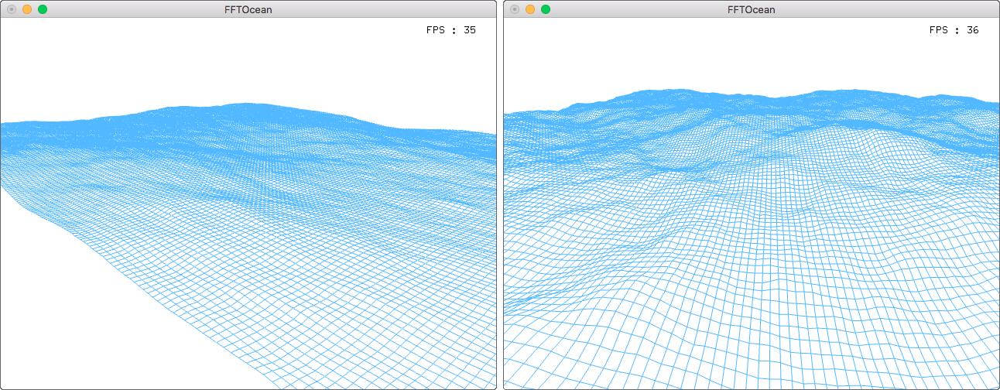

# FFT-Ocean

[Youtube video](http://youtu.be/JSNyfPAvYbg)

## PROJECT

FFT-Ocean is a C++ implementation of researcher [J. Tessendorf's paper](http://graphics.ucsd.edu/courses/rendering/2005/jdewall/tessendorf.pdf) *"Simulating Ocean Water"*. The (reverse) FFT is used to compute the 2D wave height field from the Philips spectrum. It is possible to adjusts parameters such as wind speed, direction and strength, wave choppiness, and sea depth.

## LICENSE

This project is licensed under the GPL License. See COPYING for more information.

***

### Install

Linux/Mac : `make` will create the binary in the `bin` directory.

***

### Use

To launch the simulation, call `bin/ocean`:

    bin/ocean

To close the application:
* **MacOS**: `cmd+Q`
* **Linux**: `alt+f4` or `esc`

***

### Contact

olivier . deiss [at] gmail . com