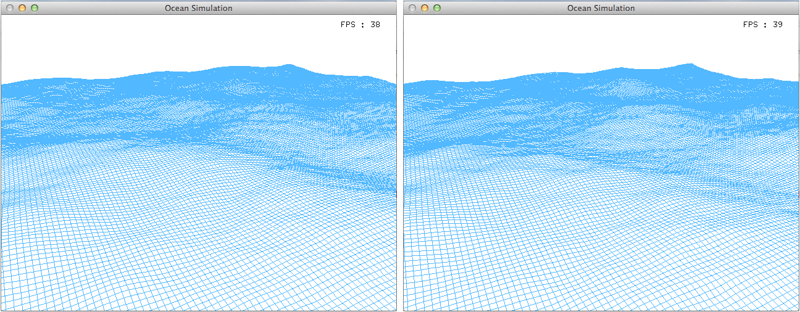

##### Project: FFT-Ocean
##### Author: DEISS Olivier
##### Started: July 2014

This project is an implementation of researcher J. Tessendorf's paper "Simulating Ocean Water":
http://graphics.ucsd.edu/courses/rendering/2005/jdewall/tessendorf.pdf

The FFT is used to compute the wave height field. In the paper, the Philips spectrum is used for the computation. It has parameters like wind speed, direction and strength, wave choppiness, and sea depth. 

Language: C++ 
Libraries: OpenGL, Glut

-----------------------------------------------------------------------------------

Youtube: http://youtu.be/JSNyfPAvYbg

-----------------------------------------------------------------------------------

The project is only available for MacOS and Linux users.

The model allows to choose the wind speed and direction, the depth and choppiness.
I originally wrote the project in french, so some classes and folders still have french names.

-----------------------------------------------------------------------------------

You can find the following directories:
   - Affichage: GUI of the project, creates a window, deals with the keyboard etc
   - FFT: my own implementation of the Cooley-Tuckey algorithm, for scientific 
           purposes. This can be replaced by using CUDA library.
   - Ocean: classes that are specific to the project

You can find both the classes Camera (to move over the water with the Z, Q, S, D
keys) and Affichage (to provide the GUI) in my repositories.

Feel free to leave any comment about the project, or if you want to improve it.

-----------------------------------------------------------------------------------

Compilation:
   - MacOS: add GLUT, OpenGL and ApplicationServices frameworks
   - Linux: $ make && make clean

To close the application:
   - MacOS: cmd+Q
   - Linux: alt+f4 or escape key

-----------------------------------------------------------------------------------

To do:
   - comment files in Affichage and FFT directories
   - add Windows version and information to compile the project (libs etc)
   - use another library instead of GLUT which is deprecated
   - add Perlin noise to compute further waves at a lower cost
   - add textures to the waves
   - keyboard control to switch parameters while running the program

